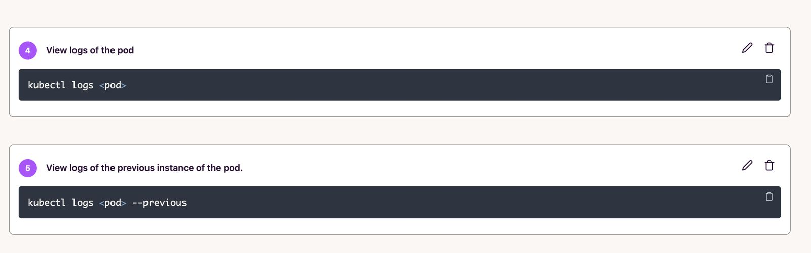
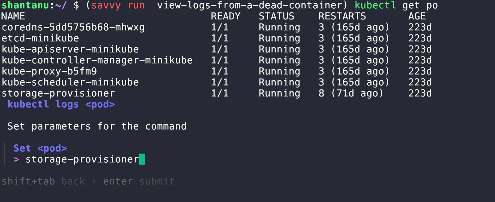

# Savvy

<h3 align="left">
  | <a href="https://getsavvy.so/discord">Discord</a> |
  <a href="https://twitter.com/savvyoncall">Twitter</a> |
  <a href="https://www.getsavvy.so/">Website</a> |
  <a href="https://docs.getsavvy.so">Docs</a> |
</h3>

Savvy is the easiest way to create, share and run runbooks from your terminal.


Savvy's CLI generates runbooks with AI or from commands you provide.

## Install Savvy's CLI

```sh
curl -fsSL https://install.getsavvy.so | sh
```

## Generate Runbooks with AI

Use `savvy ask` to generate entire runbooks or a single command using natural language.

Just run `savvy ask` and provide a prompt.

Any one can use it, there's no need to signup for an account or provide a credit card.

### Examples

1. Ask Savvy to create a runbook for publishing a new go module.


2. Ask Savvy to help you with a tricky sequence of shell commands.


## Generate Runbooks using your commands

Use `savvy record` or `savvy record history` to create a runbook using commands you provide.

You don't have to change anything about your shell or aliases, savvy auto expands all aliases to make sure your runbook runs reliably on any machine.

### Create Runbooks from your Shell History

Use `savvy record history` to go back in time and create a runbooks by selecting just the commands you want.

Savvy will never execute any command you select.


### Sharing Runbooks

Runbooks are private by default, but you can share them using a public or unlisted link from Savvy's dashboard.

You can also export runbooks to markdown and paste them in your existing docs.

### Create Runbooks with Savvy Record

`savvy record` starts a new shell and all commands in this shell are recorded and sent to an LLM to generate a runbook.


> [!NOTE]
> Creating a runbook with savvy record requires you to signup for a free account.

## Automatically Run Runbooks

Use `savvy run` to search and run runbooks right from your terminal.

Savvy automatically fills in the next command to execute. Just press enter to run it.


## Runbook Parameterization

Parameterizing runbooks is very easy with Savvy.

Replace hardcoded values with `<parameters>` from the dashboard for any step. Savvy takes care of the rest.

`savvy run` automatically detects any `<parameters>` and prompts users to fill in the value only once per parameter.





Check our [docs for more details on runbook parameterization](https://docs.getsavvy.so/guides/parameterize_runbooks/)

## Savvy Explain

Not sure what a particular command or flag does? Don't want to research an opaque error message? then `savvy explain` is for you.

Savvy explain generates a simple and easy to understand explanation for any command or error message before you can say RTFM!


### Examples

1. Use `savvy explain` to understand everything that goes into parsing a x509 certificate with openssl


2. Dive into an error message and learn troubleshooting next steps.


## FAQ

1. How do I Install Savvy?

```sh
curl -fsSL https://install.getsavvy.so | sh
```

2. How do I uninstall Savvy?

```sh

rm -rf ~/.savvy
rm -rf ~/.config/savvy

```

3. How do I upgrade Savvy?

Run `savvy upgrade` to get the latest version of the CLI.

4. How do I login?

Run `savvy login` to start the login flow.

5. What shells does Savvy support?

Savvy supports `zsh`, `bash`, and `fish`.

Please [create an issue](https://github.com/getsavvyinc/savvy-cli/issues/new) if you'd like us to support your favorite shell.

6. Does Savvy work on Windows?

Not yet.

7. I'm stuck. How do I get help?

If you need assistance or have questions:

* [Create an issue](https://github.com/getsavvyinc/savvy-cli/issues/new) on our GitHub repository.
* Join our [Discord](https://getsavvy.so/discord) server
