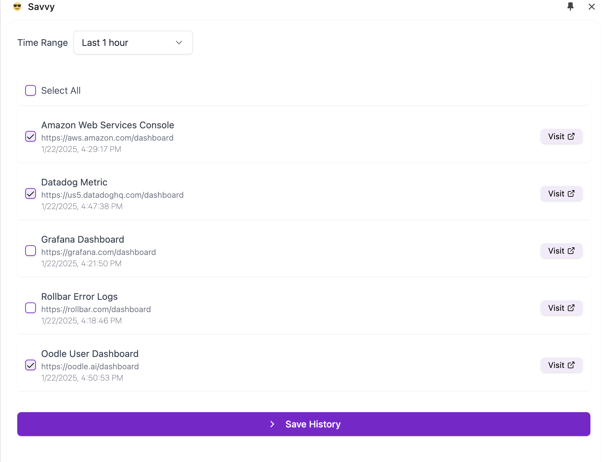

# Savvy

<h3 align="left">
  | <a href="https://chromewebstore.google.com/detail/savvy/jocphfjphhfbdccjfjjnbcnejmbojjlh"> Add to Chrome</a> |
  <a href="https://www.getsavvy.so/chrome">Website</a> |
  <a href="https://getsavvy.so/discord">Discord</a> |
  <a href="https://twitter.com/savvyoncall">Twitter</a>
</h3>

Track and Share links that help you resolve issues faster.

## Installation

### From Chrome Web Store

Add Savvy to your browser from the [Chrome Web Store](https://chromewebstore.google.com/detail/savvy/jocphfjphhfbdccjfjjnbcnejmbojjlh)

### From Source

Build the extension from source and load it into your browser as an unpacked extension.

You can follow the steps here: [How To Install Savvy's Extension From Source](https://app.getsavvy.so/workflow/rb_3294a871bc952dc6/How-To-Install-Savvy-s-Chrome-Extension-From-Source)

## How It Works

1. Choose a time range.

2. Savvy surfaces links from developer products that you visited during that time.

3. Select the links that you want to share or save.

4. Either copy the links to your clipboard or send them to Savvy's CLI.

### Acknolwedgement

This extension is based on the [boilerplate provided by Jonghakseo](https://github.com/Jonghakseo/chrome-extension-boilerplate-react-vite)
