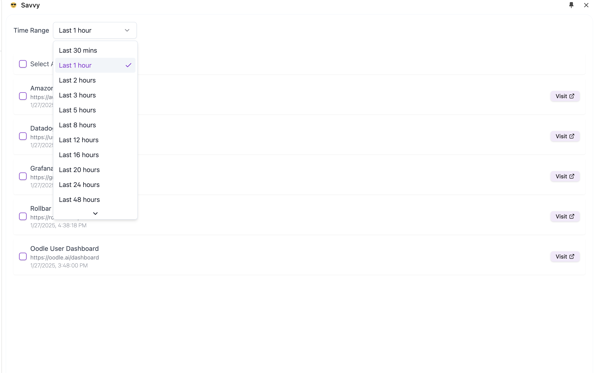
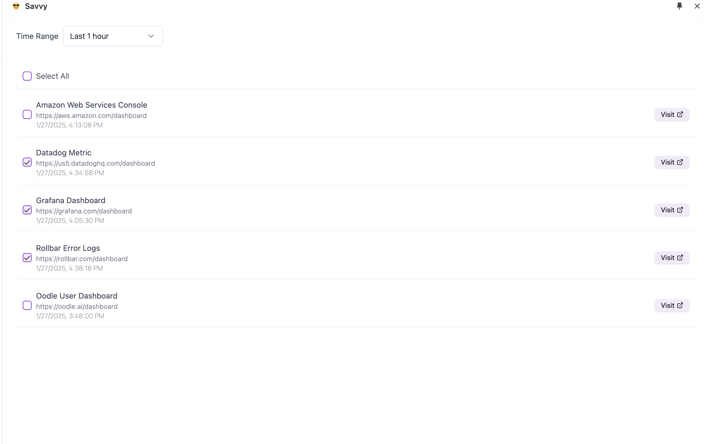
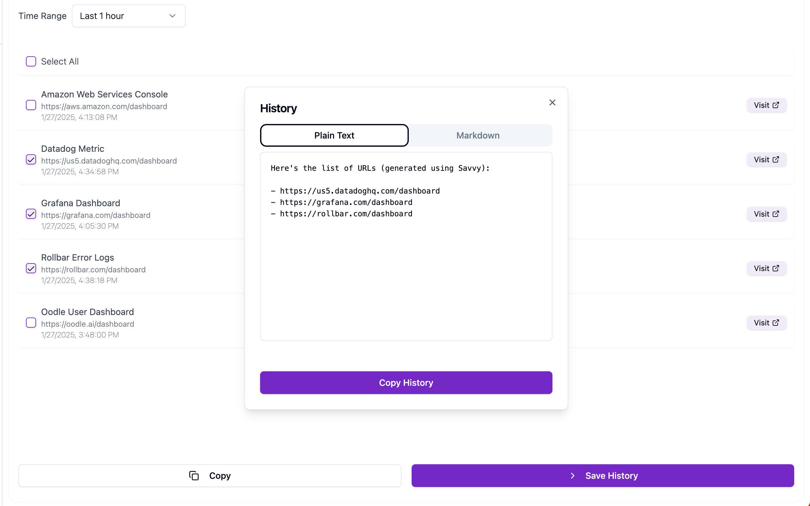
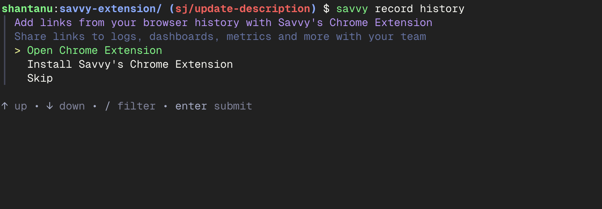

# Savvy

<h3 align="left">
  | <a href="https://chromewebstore.google.com/detail/savvy/jocphfjphhfbdccjfjjnbcnejmbojjlh"> Add to Chrome</a> |
  <a href="https://www.getsavvy.so/chrome">Website</a> |
  <a href="https://github.com/getsavvyinc/savvy-cli?tab=readme-ov-file#install-savvys-cli"> Get Savvy's CLI</a> |
  <a href="https://getsavvy.so/discord">Discord</a> |
  <a href="https://twitter.com/savvyoncall">Twitter</a>
</h3>

Track and Share links that help you resolve issues faster.

Use Cases:

- Share your entire debug path or highlight links crucial to solving a bug.
- Attach a log of your actions to any issue or postmortem in seconds.

## Installation

Add Savvy to your browser from the [Chrome Web Store](https://chromewebstore.google.com/detail/savvy/jocphfjphhfbdccjfjjnbcnejmbojjlh)

## How It Works

1. **Click on the extension icon -> Savvy surfaces relevant links from your browser history.**

2. **Select the links that you want to share.**

3. **Copy selected links to your clipboard or send them to Savvy's CLI.**

## Integration with Savvy's CLI

Savvy's chrome extension works seamlessly with Savvy's CLI.

You can send selected links to Savvy's CLI and attach them to commands captured by Savvy's CLI.

After running `savvy record history` or `savvy record` follow the prompts and when it's time to attach links, savvy will open the extension for you.

## Install from Source

Build the extension from source and load it into your browser as an unpacked extension.

You can follow the steps here: [How To Install Savvy's Extension From Source](https://app.getsavvy.so/workflow/rb_3294a871bc952dc6/How-To-Install-Savvy-s-Chrome-Extension-From-Source)

## Privacy

Savvy's chrome extension does not store any of your browsing history. It only reads your browsing history to surface [relevant links.](https://github.com/getsavvyinc/savvy-cli/blob/main/savvy-extension/pages/side-panel/src/components/HistoryViewer.tsx#L51)

Selected links are copied to your clipboard or sent to Savvy's CLI.

You can choose to store workflows generated from Savvy's CLI on Savvy or export data locally on your machine.

## Acknolwedgement

This extension is based on the [boilerplate provided by Jonghakseo](https://github.com/Jonghakseo/chrome-extension-boilerplate-react-vite)
